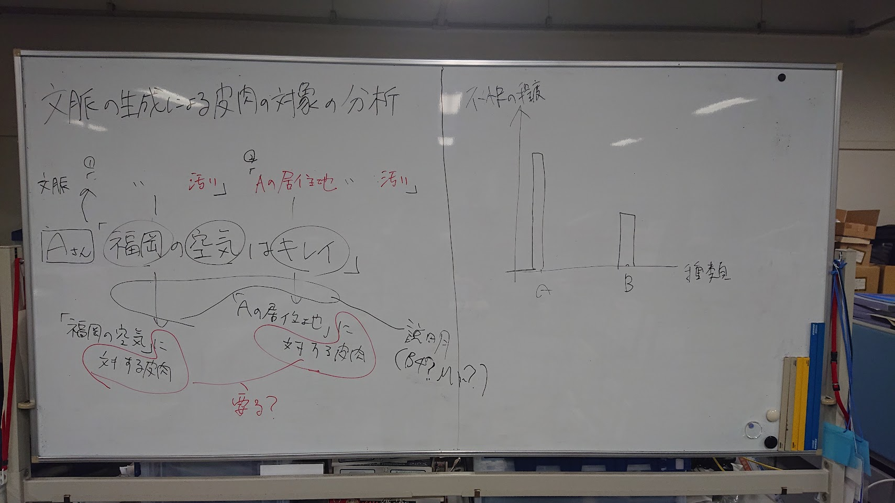
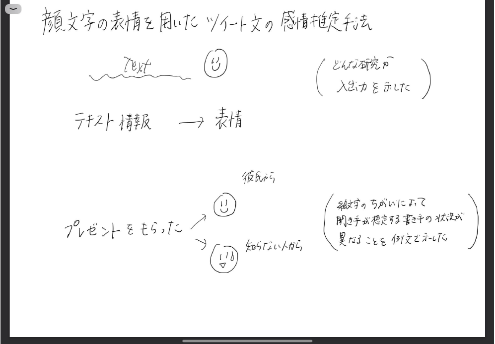
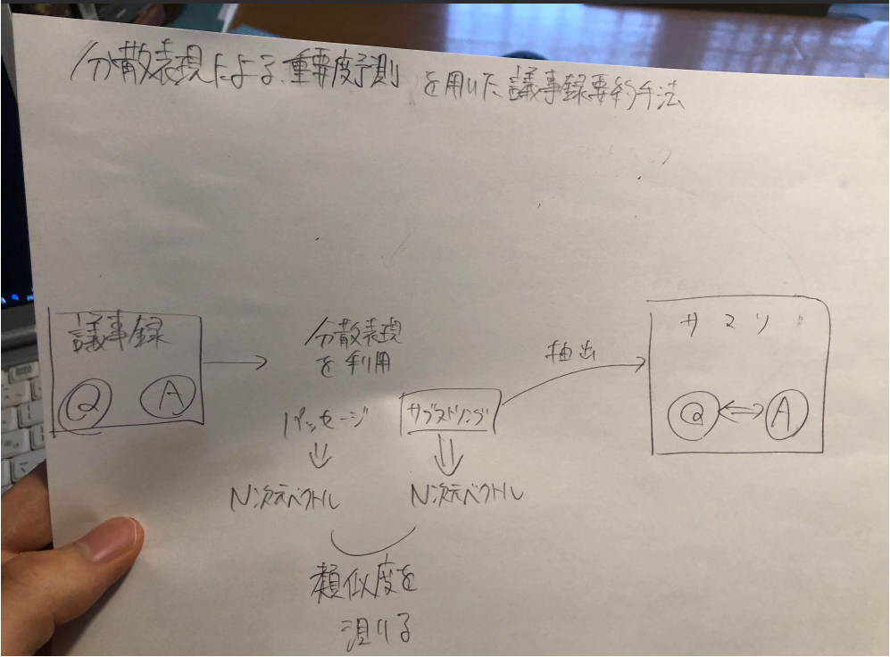
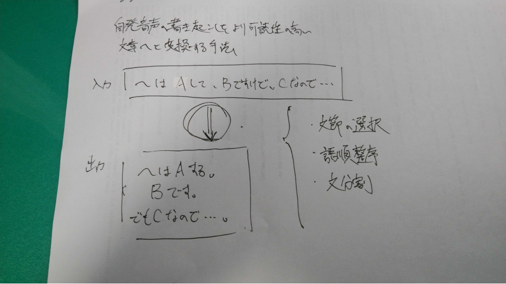

# ホワイトボード発表について
***
- 特別選抜でも一般選抜でもホワイトボードを使って院試研究計画を発表します。
- 3, 4人の先生方が試験官です。(森先生、白川先生、富井先生、岡嶋先生等)

## 本学の情報環境専攻を志望した理由について具体的に説明
***
志望理由書に書いた内容を10秒くらいで話せばOK。

## ホワイトボードを使った研究計画の発表
***
先生達に対して、ホワイトボードを使って5分以内で研究計画について発表します。

1. 研究のタイトルまたは概要（30文字以内）
2. 研究の課題と内容
3. 研究を行う意義とニーズ、特徴、他の研究との関係、社会に与える影響など

### 以前の書き方の例

ホワイトボードの真ん中の線で左右に分け、左に学部生での研究計画、右に大学院進学後の研究計画を書くよう指示されます。

ホワイトボードという限られた範囲で書きながら話すので、書く内容は本当に大事な部分だけに絞る必要があります。タイトル書くだけで30秒くらい取られると思っても良いくらい時間ないです。

 - キーワード
 - 図
 - 例文、具体例

こういったものを簡潔に書けば良いと思います。

一つのテクニックとして、タイトルを書きながら研究背景を説明するというのがあります。書きながら別のことを話すというのは思ってるより難しいですが、練習すれば出来るようになります。（こんなことをしなくても内容を詰めれば受かると思います）

昨年と一昨年は、コロナ対策でゴム手袋を付けさせられました。

また、去年はホワイトボードマーカーは黒しかなかったので、多色は使えない前提で挑みましょう。

あと個人談ですが、呼ばれてから部屋に入るまでドアが開いていたため。ドアをノックする必要がありませんでした。（勿論挨拶はする）

## 質問
***
ホワイトボードの発表を受けて、試験官の先生から3個ほど質問されます。質問内容としては、発表した研究内容について踏み込んできます。普通に内容に関する質問がメインだと思いますが、社会的ニーズや評価方法、新規性等も聞かれるかも知れません。

「研究を進めるために必要とされる基礎学力を検査する設問」というのが特別選抜の要項に書かれると思いますが、これが上記の質問に当たると思って良いと思います。

普段の院試発表練習でのM1,M2からの質問に答える感じで上手く対応できれば大丈夫だと思います。
予想外の質問が来ても、思い付く付かない以前に、ある程度の時間考えた上で回答するのが良いかと。頭ごなしに「分からんから今後考えます」だと印象悪そう。

## 他大学の大学院を併願するか？
***
他大学院の大学院を受験するか聞かれます。

## 院試当日の服装について
***
恐らく私服でもスーツでも可。スーツが無難だと思われますが、昨年は私服とスーツ半々ぐらいで驚きました。(私はスーツで行きましたが、控え室がクソ暑くて汗だくでした)
